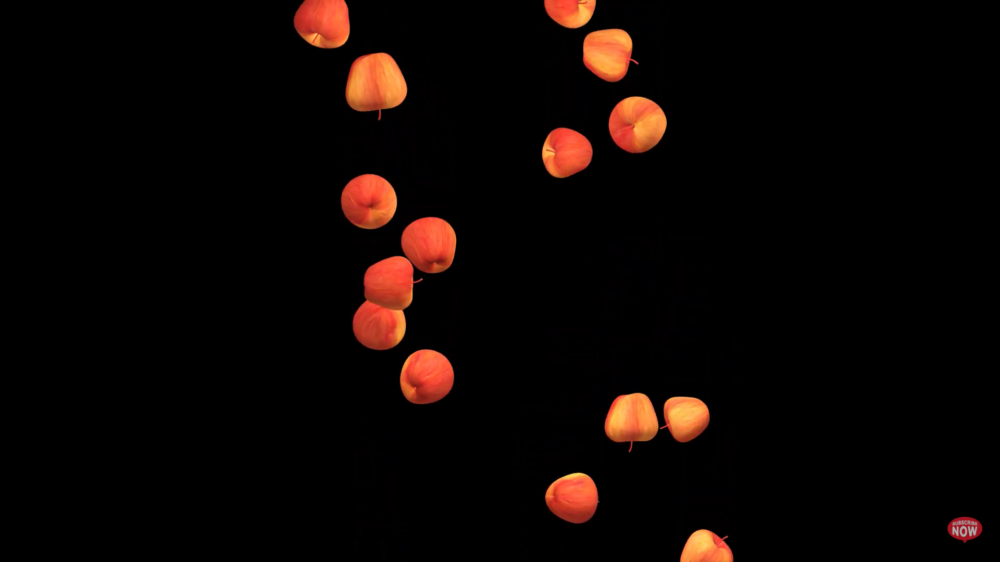
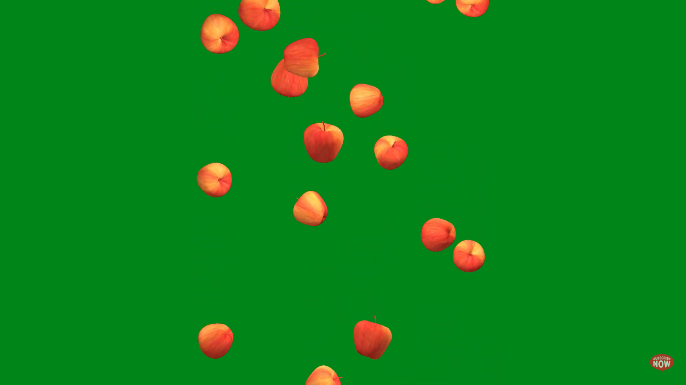

# Quiz 8

This is my local change for quiz 8 to the repo.

## Part 1: Imaging Technique Inspiration

I wanted to incorporate the imaging technique of the falling apples in a TouTube video clip into our project. Anwar Jalal Shemza's Apple Tree combines circles, rectangles, lines, and colours. I wanted to animate these ‘apples’ on the painting so that they fall from the tree to the ground, interacting with the boundaries of the painting and even bouncing back. According to the assignment, this can be done by either incorporating mouse or keyboard inputs for animation or by employing timers and events. This technique makes the image look richer and more interesting and increases the viewer's involvement.

>[3D Apples Falling Animation in Green Screen and Black Screen No Copyright Video](https://www.youtube.com/watch?v=GLVIqepC9p0)

## Part 2: Coding Technique Exploration

By using Array, we can get a lot of ‘apples’ in a simple code. By using for loops, we can just write draws, moves, and resets a ‘apple’ once, and then apply these to all the apples. By delaying the initialisation of the array, setting the value of each of the indexes individually, we can efficiently declare all the variables needed to complete the animation. Eventually, we can combine all these code to make these ‘apples’ fall to the ground (the edges of this image) from different locations.

>[example implementation and code](https://happycoding.io/tutorials/p5js/arrays)